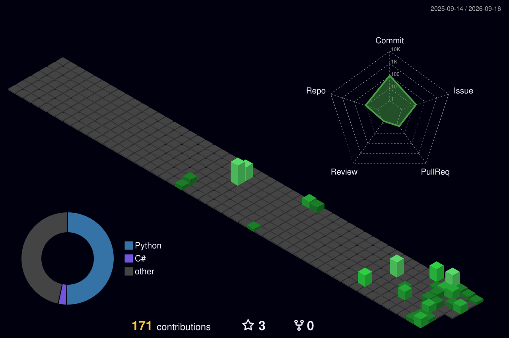

# Hi 👋, I'm Pedro Henrique

Estudante de Gestão da Informação (UFU) | Data Engineering & Analytics

---

## 👤 Sobre mim

Sou estudante de **Gestão da Informação** na **Universidade Federal de Uberlândia (UFU)**, atualmente no 5º período.

Venho aprendendo a construir soluções de dados na prática, desde planilhas e APIs até bancos de dados na nuvem e dashboards em Power BI.

- 🔭 Atualmente construindo: pipelines de ETL e dashboards analíticos
- 🌱 Aprendendo: automação avançada e boas práticas de engenharia de dados
- 💬 Pergunte-me sobre: C#, Python, SQL, Power BI, ETL
- 📫 Como me encontrar: veja os contatos no final

---

## 🚀 Stack

---

## 📌 Projetos em destaque

- 🚲 **[Cairo Special Bikes](https://github.com/pedrinvazzz-code/Cairo-Special-Bikes)** — Pipeline de ETL automatizado (Google Sheets → Supabase → Power BI), em uso real por um negócio
- 🗳️ **[Banco de Dados - Eleições 2024](https://github.com/pedrinvazzz-code/banco-de-dados-eleicoes-2024)** — Consultas SQL avançadas sobre mais de 900 mil registros
- 🐼 **[Dominando Pandas](https://github.com/pedrinvazzz-code/Dominando-Pandas)** — Estudo autodirigido de análise de dados com Python
- 💻 **[POO em C#](https://github.com/pedrinvazzz-code/POO-em-Csharp-)** — Progressão de exercícios até um sistema completo de locação de veículos

---

## 📈 Gráfico de Atividade

---

## 📈 Gráfico de Contribuições

---

## ✉️ Contato

